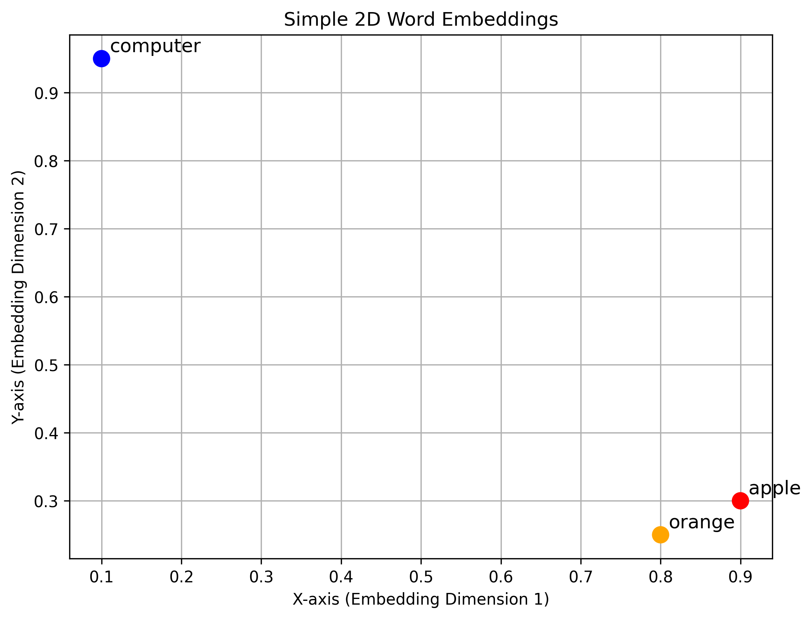
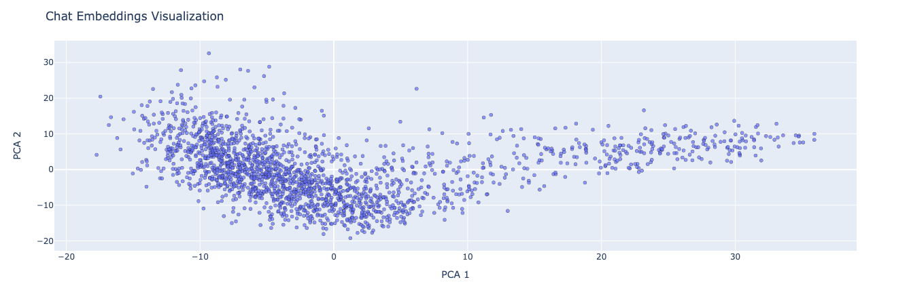

# Retrieval Augmented Generation (RAG)

Retrieval Augmented Generation (RAG) allows us to query large sets of data and utilize that information in our model responses. This repository contains two scripts and the associated test data to get started using this technique.

## 🤖 What's the Purpose?
In our previous starterkits, our main constraint was the amount of tokens we could process within a given interaction. Token limitations significantly hamper our ability to process large amounts of unique data - and while Large Language Models (LLMs) are formidable, their responses are constrained by their training data, particularly for tasks that require specific or specialized information. This is where Retrieval Augmented Generation (RAG) comes into play.

RAG equips the model with a dynamic capability: to 'search' and reference external sources on-the-fly, essentially bridging the gap between static internal knowledge and specific external information. Instead of relying entirely on what the model knows from its training, RAG identifies informaiton within external sources and leverages both built-in knowledge, informaiotn retrieved from an external source, and user provided prompts to provide more informed factual answers.

As a practical example we consider a large corpus of leaked chats between ransomware operators spanning multiple years and containing approximately 2.6 million words. Our goal is to transforn this large corpus of chat data into a queryable dataset which we leverage as an intelligence capability.

## Introduction to Embeddings

At its core, 'embedding' refers to the process of converting textual data into numerical vectors that exist in a multi-dimensional space. These vectors, (referred to as 'embeddings') represent words or sentences within this space such that similar content resides closer together. An easy way to think of embeddings is as pins on a map - words or phrases that are similar are pinned closer together while different ones are further apart. Essentially, it is a method to quantify and represent the nuanced meanings of words or phrases in a way that captures their semantic relationships. Embeddings are an important concept to understand because they are a cornerstone in modern Natural Language Processing (NLP) applications.

**A Simple Analogy** 

Consider three words: `apple`, `orange`, and `computer`

We instinctively know that both apples and oranges are fruit and that computers are electronic devices. If we were to place these words in a space based on their meanings we would group `apple` and `orange` together and place `computer` further away. 

To translate this intuition into numbers, imagine a 2-dimentional space where each word has a given set of coordinates:

* `apple`: `[0.9, 0.3]`
* `orange`: `[0.8, 0.25]`
* `computer`: `[0.1, 0.95]` 

Lets plot these coordinates!:



When we plot the coordinates it becomes evident that `apple` and `orange` are nearer to eachother than either is to `computer`. This spatial arrangement mirrors their real-world relationships, illustrating the essence of embeddings: portraying the semantic relationships of words through a numerical, geometric space. Below is a 2D embddding of our chat data used in this walkthrough.



While our example is grounded in a 2D space for simplicity, the true value of embeddings becomes apparent in higher-dimensional realms. These multi-dimensional spaces can depict intricate relationships and nuanced contexts between words, diving deeper than mere surface-level similarities. Relationships between words (or sentences) can be captured in even richer detail, encompassing nuances and context that go beyond simple direct similarities. 

## 📋 Overview

**Embedding Script:** 

The script `json_chat_embedding.py` processes our chat data from `combined.json` and converts it into a structured format ideal for embeddings using the `text-embedding-ada-002` model. Embeddings for each data segment are generated and then saved in a CSV file.

**Query Script:** 

The script `query_embeddings.py` transforms user queries into embeddings and compares the query embedding to the embeddings in our CSV file to find the most relevant chunks of chat data. Once identified, these segments, along with the initial query, are sent to GPT-4 to yield a response anchored in the most relevant chat data.

# 🚀 Quick Start

**Pre-requisites**

* Python 3.x
* OpenAI API key (with GPT-4)
* Some large dataset (`combined.json` provided in this walkthrough)

**Libraries:**
```bash
pip install openai pandas transformers scipy
```

## Embedding Script

This script transforms a collection of chat messages into embeddings, which are compact representations of text that capture semantic meaning. These embeddings will be used to quickly identify similar text and retrieve relevant messages. Note, the script provided in this starter-kit is an example and not universally applicable to your data! 

Here is a breakdown of how it works:

**Input Data Structure**

The script expects data in the file `combined.json` with the following structure:

```json
[
    {
        "ts": "timestamp",
        "from": "sender",
        "to": "receiver",
        "body": "message_content"
    },
]
```

Each entry corresponds to a chat message obtained from the ransomware group chat. For example:

```json
[
  {
    "ts": "2020-09-15T14:43:14.291211",
    "from": "dandis@q3mcco35auwcstmt.onion",
    "to": "target@q3mcco35auwcstmt.onion",
    "body": "Я уточню у Профа, что роздано. Я так и не получил отчет, что в работе"
  },
]
```

### How the Script Works

1. **Initialization:** 
* The script employs the tokenizer from the `transformers` library to break down the text into smaller units (tokens).
2. **Data Loading and Processing:** 
* Loads and parses JSON data 
* Each chat entry is merged into one string, keeping the chronological order intact.
3. **Chunking**
* The combined chat data undergoes tokenization.
* The data is divided into chunks, with the size governed by the `TOKEN_LIMIT`. This ensures the data adheres to model constraints.
* A bit of `OVERLAP` is added between these chunks to maintain context continuity.
4. **Embedding Process:** 
* Data chunks are sent for embedding in batches
* Rate limits of the API are taken into account; hence, tokens processed every minute are tracked. If the script nears the rate limit, it'll take a brief pause to avoid exceeding it.
5. **Data Compilation:** 
* The script combines each text chunk and its corresponding embedding into a dataframe. This dataframe is saved as `embedded_chats_json.csv`

**Running the script**

The script can be run directly from the command line:

```bash
python json_chat_embedding.py
```

Depending on the amount of text you are embedding this may take awhile.

## 🕵️ Query and Generate (the RAG part)

Once the embeddings are generated, you can start querying the dataset using the `query_embeddings.py` script. Our method uses cosine similarity to identify the most relevant chunks of chat messages for a given query and then use GPT-4 to provide answers based on relevant data.

### How the Script Works

1. **Initialization:**
* The embeddings from the CSV are loaded into a Pandas dataframe.
* Each embedding, initially stored as a string representation is converted back to a list structure using the `ast.literal_eval` method.
2. **Query Processing**
* The script tokenizes the user query using the `transformers` library.
* This tokenized query is converted into an embedding with the `query_to_embedding` function. This step translates the query into a vector space representation, aligning it with the embeddings of the chat messages.
* To find relevant chat messages, the script calculates cosine similarity between the query embedding and the chat embeddings. The cosine similarity gives a measure of how closely the meanings of the query and chat messages align.
* The `get_most_similar_chats` function is employed to rank all chat chunks based on their cosine similarity scores with the user's query. This function also returns the top 'n' most similar chat chunks.
3. **Chunk Contextualization:**
* Understanding context is key to generating meaningful responses. The script takes the most similar chat chunk and combines it with the user's original query to frame a contextual question. Contextual questions are designed to provide GPT-4 with relevant information, enabling it to generate a coherent and pertinent answer.
4. **Interaction with GPT-4:**
* The `gpt_answer`` function provides the contextualized prompt to GPT-4. The prompt is interpreted by the model within the context of the chat chunk and the original query.
5. **Result Presentation:**
* Prior to returning answers, the script displays the top relevant chat chunks to the user. This step may help users understand the basis for the response generated by the model.
* The models response is presented to the user. This response, backed by the relevant chat chunk, offering a fact-based answer to the user's query.

## 💡 Tips for Effective Embedding

* **Clean Data:** Before embedding, ensure that your data is cleaned and pre-processed. Removing stop words, punctuation, and special characters can help in generating more meaningful embeddings.
* **Tuning:** Depending on the nature of your data, it might be beneficial to adjust model parameters or choose a different embedding model entirely. Experiment with different configurations to find the best fit for your specific use case.
* **Dimensionality:** Consider the number of dimensions in your embedding. While higher dimensions might capture more detailed semantic relationships, they also increase the computational cost and might lead to diminishing returns.
* **Context:**  Whenever possible, try embedding larger chunks or sentences rather than individual words. This captures context and provides richer semantic information.

## 📝 Examples

### Example 1

**Enter your query:** *What challenges do adversaries have with windows defender? please provide specific examples from the chat logs.*

Top relevant chat chunks:
822     м 2020-09-16T19:27:46.492184 bentley@q3mcco35a...
1332    :      Microsoft-Windows-Windows Defender/Oper...
1333    cco35auwcstmt.onion logan@q3mcco35auwcstmt.oni...
1334     Microsoft-Windows-Windows Defender\nDate:    ...
1500    et@q3mcco35auwcstmt.onion defender@q3mcco35auw...
Name: chunk, dtype: object

Answer based on the most relevant chat chunk:

From the presented chat, one of the major challenges that adversaries face with Windows Defender is the detection and blocking of their unauthorized activities. Here are specific examples:

1. Antivirus Detection: The chat records indicate that the Microsoft Windows Defender Antivirus successfully detected a severe threat: "Microsoft Defender Antivirus has detected malware or other potentially unwanted software." The detected threat was a severe Trojan named 'Win32/Wacatac.B!ml'. This reflects a challenge to the adversaries as their activity (thus malware) was identified and potentially blocked by the antivirus.

2. Warning Alert: There's another reference where one of the adversaries mentions "Хром алертит" which translates to "Chrome alerts". This could imply that Windows Defender has raised a warning signal for suspicious activity which is a hurdle for the adversary.

3. File Quarantine: At another point, one user sends a file link for the other to check, possibly a malicious file. The reply was "Но детекта нет" which translates to "But there is no detect". It could be interpreted that their malicious files are identified and quarantined, posing a challenge to their activity.

These examples demonstate that Windows Defender acts as a barrier against the adversaries' harmful activities, creating significant challenges for them.

### Example 2

**Enter your query:** *provide me a list of targeted companies in 2020*

Top relevant chat chunks:

* 960     :25] <prof> Web Domain      Revenue source    ...
* 1347    3811 target@q3mcco35auwcstmt.onion stern@q3mcc...
* 875     3mcco35auwcstmt.onion 80+ людей готовы прийти ...
* 935     .onion bentley@q3mcco35auwcstmt.onion стерн оч...
* 732     T20:04:07.456951 target@q3mcco35auwcstmt.onion...

Name: chunk, dtype: object

Answer based on the most relevant chat chunk:

Here is the list of the companies that seem to be targeted based on the provided chat message:

1. The Money Store Company (themoneystore[.]com)
2. Broe Group Company (broe[.]com)
3. Evertz Microsystems Ltd. (evertz[.]com)
4. Flemington National Bank (flemington[.]com)
5. Network Capital Funding Corporation (networkcapital.net)
6. Pac-Van Inc. (pacvan[.]com)
7. The Siegfried Group LLP (siegfriedgroup[.]com)
8. Advance Tabco (advancetabco[.]com)
9. Life Quotes Inc. (lifequotes[.]com)
10. Mellanox Technologies Inc. (mellanox[.]com)
11. New Castle Building Products (ncbp[.]com)
12. Watermark Retirement Communities Inc. (watermarkcommunities[.]com)
13. Northtown Automotive Companies (northtownauto[.]com)
14. PayneWest Insurance Inc. (paynewest[.]com)
15. The Verdin Company (verdin[.]com)
16. Tom Holzer Ford (tomholzerford[.]com)
17. Tiong Seng Group (tiongseng[.]com.sg)
18. The Matches Group (matches[.]com)
19. Valeant Corp. (valeant[.]corp)

Please note that this list is generated assuming the domain names provided in the message point to the intended targets, and the actual targets may differ if the domain names are misleading.

## 🌱 Conclusion & Next Steps

The Retrieval Augmented Generation (RAG) technique provides a powerful mechanism to generate more data-driven and informed responses by bridging the gap between static knowledge and dynamic queryable datasets. 

Some Next Steps:

**Scale up:**
Experiment with larger datasets or diversify the type of information sources.

**Optimize:** Fine-tune embedding models or consider more advanced similarity measures beyond cosine similarity.